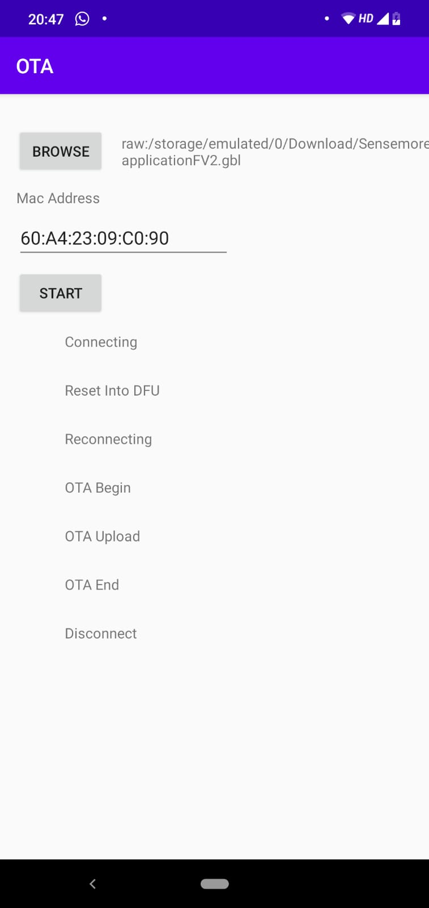

# slilabs-ota
OTA firmware update application for slilabs BLE 

Example application of OTA firmware upload for slilabs BLE devices.

There are almost infinte number of scenarios while doing OTA process. I tried to cover some of them
- Connect target device
- If target device not in DFU mode reboot into DFU
- If target device already in DFU mode skip reboot 
- Open .gbl file
- Validate connectivity and mac address
- Begin OTA
- Upload with 'WRITE_TYPE_NO_RESPONSE'
- Requesting required android permissions

# TODO

- Validating .gbl file
- Increase Error handling and state management
- Gracefully disconnect from BLE device
- Rety mechanism
- Configuranle MTU(And why we have to request 3 more bytes ? )
- Progress in bitrate
- Reliable upload
